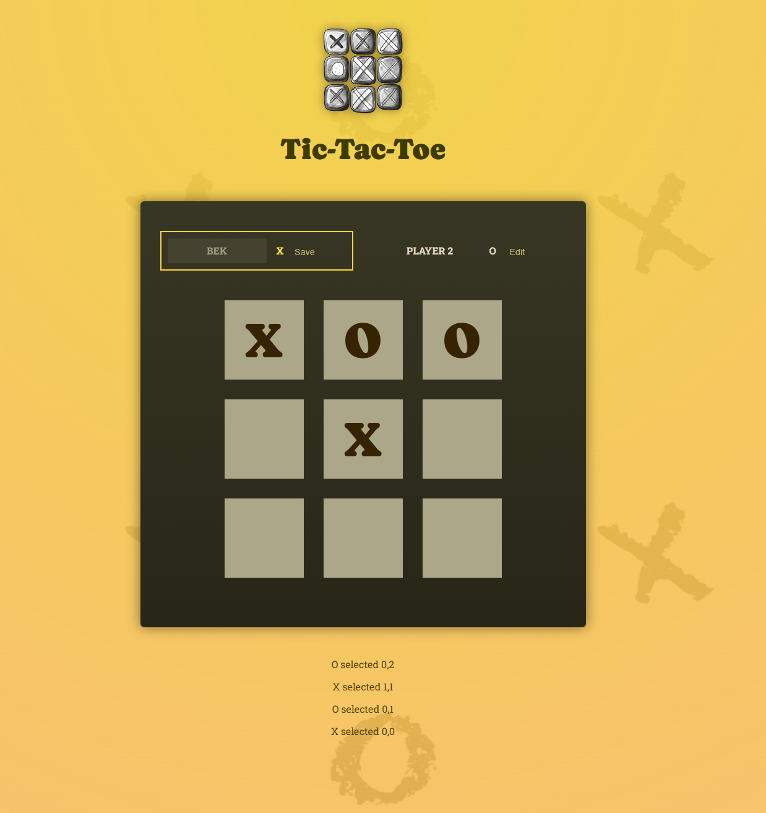
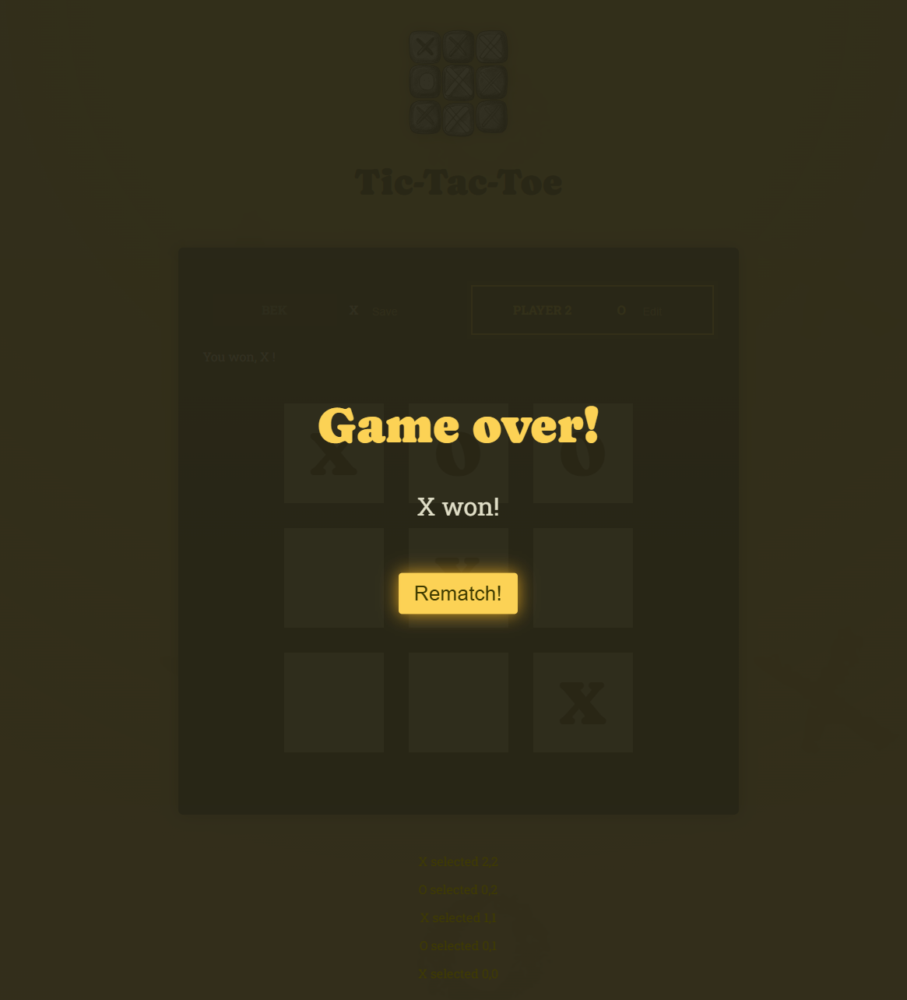

# 🎮 Tic-Tac-Toe game

An interactive React Tic-Tac-Toe game for two players!

---

## 📸 Screenshots

<p >
  
  
</p>

---

## 🚀 Features

- Smooth and interactive gameplay
- Responsive design
- Custom graphics and animations
- Fun for all ages

---

## 🛠️ Installation & Setup

1. **Clone the repository**
   ```
   git clone https://github.com/yourusername/your-repo.git
   cd your-repo

   ```

Install dependencies

npm install
Run the game


npm start
🎯 How to Play
Launch the game using the instructions above.

Follow the in-game prompts.

Enjoy and try to win!

📂 Folder Structure

.
├── assets/            # Images
├── src/               # Source code for the game
├── public/            # Screenshots, Images
├── package.json       # Project dependencies
└── README.md          # Project documentation

🤝 
Contributions are welcome!
Please fork the repository and submit a pull request.

📜 
Inspired by Max Implemented by Bek

